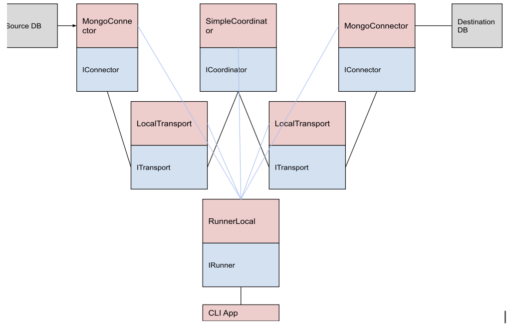

# Core Principles 

* Isolation and abstraction
Entities only use interfaces of others. Imagine implementations distributed as separate packages
* Remote readiness
Assume that components can run remotely - don't exchange pointers or references to locally allocated objects
* Async-first
Anything that may possibly block should be executed asynchronously - no inline blocking calls

# High Level Overview

We use a modular software architecture, consisting of independent and isolated components. The high level overview of our strategy is to have two independent Connectors, where one reads from the source database to a data channel, and the other writes from the data channel to the destination database. We use coordinator and transport components to create and manage the data channel between the connectors.

# Building Blocks

### Interfaces

#### Connector Interface: 
* Manages connections in a networked or distributed system in order to read to a channel from source database and write from the channel to the destination database.
* Methods include functionality to setup and close connections.
* Implements the *ConnectorICoordinatorSignal Interface* which has methods to set connector capabilities, get the connector's status, asynchronously read to channels and write from channels, and asynchronously request data integrity checks.

#### Coordinator Interface: 
* Manages and coordinates data flow between connectors.
* Methods include functionality to setup the coordinator with a transport and state store, cleanup and close open connections, and retrieve details about all connectors managed by the coordinator. 
* Implements the *CoordinatorIConnectorSignal Interface* which manages connectors and includes methods for connectors to communicate with the coordinator.

#### Transport Interface
* The data migration is completed by sending data between the different components, and the transport interface manages data flow between a connector and the coordinator.
* Includes methods to create, retrieve, and close data channels in order to send or receive data messages asynchronously.
* Can retrieve an instance of *CoordinatorIConnectorSignal* in order to manage and coordinate connectors. 

#### Runner Interface
* Manages the execution of a task using setup, run, and cleanup methods

#### Statestore Interface
* Generic perstitent store
* Allows coordinator to save and retrieve the state of things like a Flow to support resumability 

### Classes
The architecture consists of various classes that implement the above interfaces, as shown in the class diagram. 

We have the following classes:
- **MongoConnector**  is a *Connector* implementation that connects to MongoDB databases and implements reading the Change Stream and writing changes to databases.
- **SimpleCoordinator** is a *Coordinator* implementation and manages data flow between the connectors. 
- **TransportLocal** is a *Transport* implementation using Go channels.
- **RunnerLocal** is a *Runner* implementation which uses the above classes to run dsync locally, using *SimpleCoordinator* to start a data flow between source and destination *MongoConnectors*.
- **StatestoreMongo** is a trivial *Statestore* implementation using MongoDB as a backend.

We have the **CLIApp** wrapper class which uses an instance of *RunnerLocal* to run *Dsync* on the command line. 
