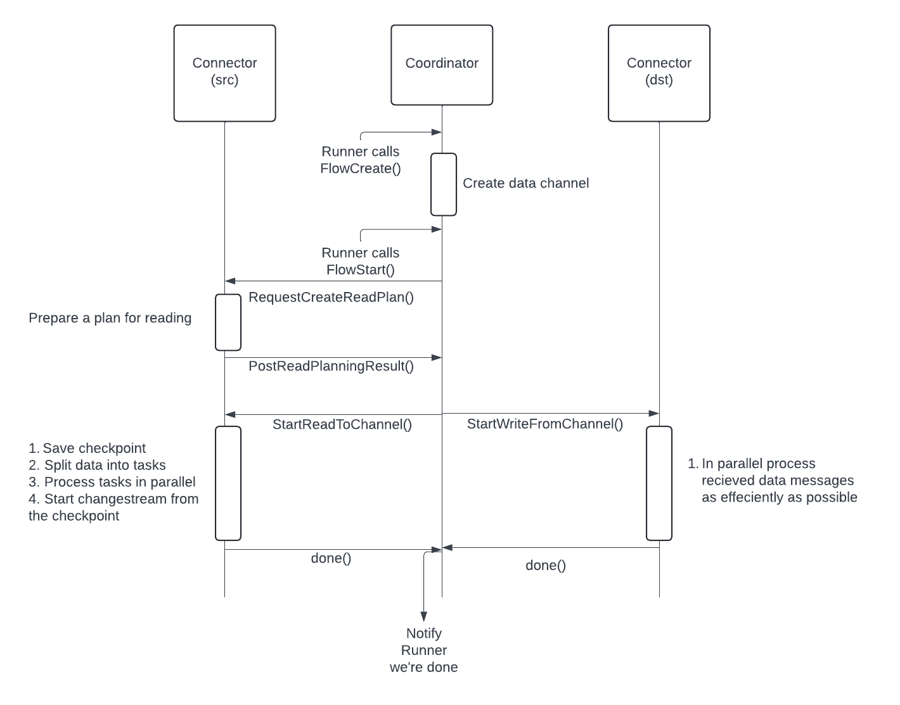

# Communication Flow

# Execution Flow

Here we show in depth the execution flow for dsync and the various errors that you may encounter. It may be outdated,
but gives a good overall idea of what's going on.
See the [Architecture docs](Architecture.md) for more information on individual classes and interfaces.

