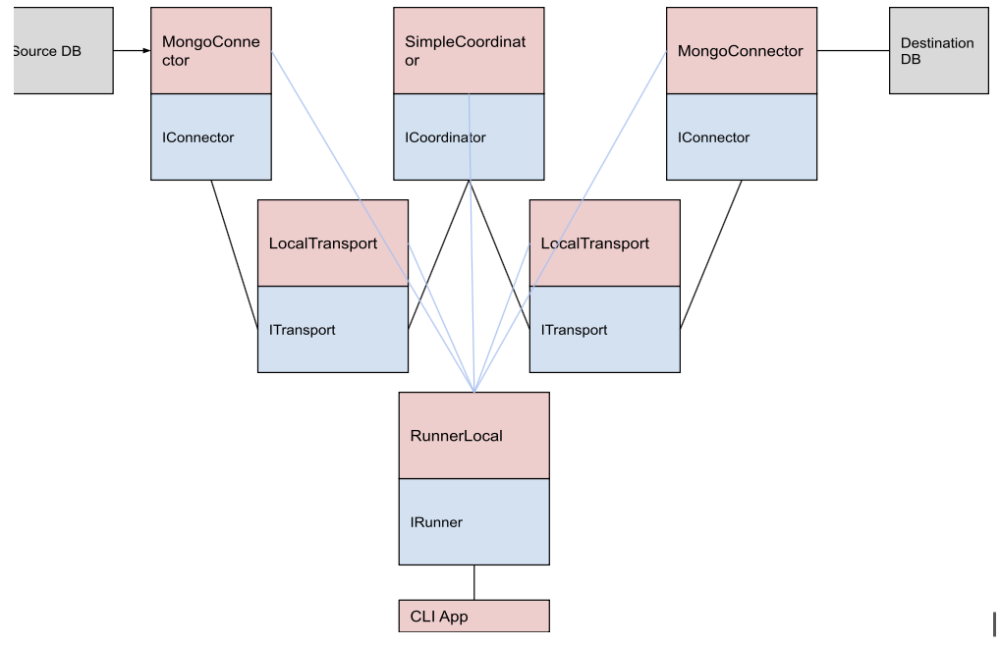

# Core Principles 

* Isolation and abstraction
Entities only use interfaces of others. Imagine implementations distributed as separate packages
* Remote readiness
Assume that components can run remotely - don't exchange pointers or references to locally allocated objects
* Async-first
Anything that may possibly block should be executed asynchronously - no inline blocking calls

# High Level Overview

We use a modular software architecture, consisting of independent and isolated components. The high level overview of our strategy is to have two independent Connectors, where one reads from the source database to a data channel, and the other writes from the data channel to the destination database. We use coordinator and transport components to create and manage the data channel between the connectors.

# Building Blocks

### Interfaces

#### Connector Interface: 
* Manages connections in a networked or distributed system in order to read to a channel from source database and write from the channel to the destination database.
* Methods include functionality to setup and close connections.
* Implements the *ConnectorICoordinatorSignal Interface* which has methods to set connector capabilities, get the connector's status, asynchronously read to channels and write from channels, and asynchronously request data integrity checks.

#### Coordinator Interface: 
* Manages and coordinates data flow between connectors.
* Methods include functionality to setup the coordinator with a transport and state store, cleanup and close open connections, and retrieve details about all connectors managed by the coordinator. 
* Implements the *CoordinatorIConnectorSignal Interface* which manages connectors and includes methods for connectors to communicate with the coordinator.

#### Transport Interface
* The data migration is completed by sending data between the different components, and the transport interface manages data flow between a connector and the coordinator.
* Includes methods to create, retrieve, and close data channels in order to send or receive data messages asynchronously.
* Can retrieve an instance of *CoordinatorIConnectorSignal* in order to manage and coordinate connectors. 

#### Runner Interface
* Manages the execution of a task using setup, run, and cleanup methods

### Classes
The architecture consists of various classes that implement the above interfaces, as shown in the class diagram. 

#### MongoConnector Class
* Implements the *Connector* interface and represents a connection to a MongoDB database
* Has attributes for a local transport connection and a coordinator to manage the data flow from one database to another
* Can set capabalities to be a connection to a source database or destination database
* Has additional methods that allow retrieval of all databases and collections excluding system data, as well as methods to read and process the change stream, performing database operations (insert, updates, and delete)
#### SimpleCoordinator Class
* Implements the *Coordinator* interface and has attributes for a Transport, State Store, and maps for the connectors and data flows.
* Has additional methods to get, add, and delete connectors and flows to their corresponding maps by Id, allowing for a thread safe architecture.
* Manages and coordinates data flows via Data Channels.

#### LocalTransport Class
* Implements the *Transport* interface and has class attributes including a coordinator endpoint and a thread safe map of Data Channels.
#### LocalRunner Class
* Implements the *Runner* interface, and connects the *MongoConnector*, *SimpleCoordinator*, and *LocalTransport* classes together as shown in the diagram
* Has attributes for source and destination connectors, a coordinator, a transport, and a state store, which are initialized with their corresponding classes, and during setup, the runner sets up each of the components individually. Likewise, during cleanup, the runner teardowns each component individually.
* Executes the data migration via the run method: the runner uses the coordinator to create and start a flow between the source and destination connectors, and waits for it to complete.