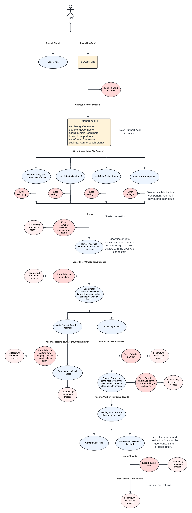
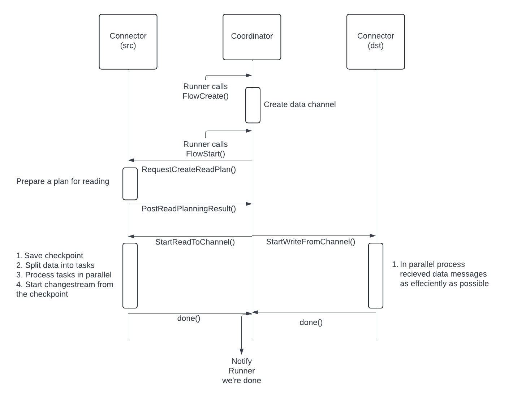

# Execution Flow

Here we show in depth the execution flow for dsync and the various errors that you may encounter. 
See the [Architecture docs](Architecture.md) for more information on individual classes and interfaces.

# Communication Flow

